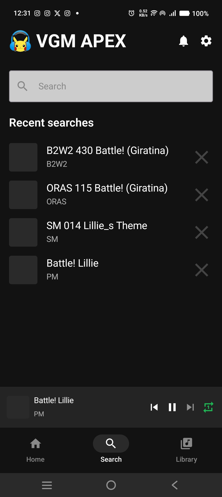

  <h1>VGM APEX - Video Game Music Audio Player EX</h1>
  

## 🎮 A Spotify-like Experience for Video Game Music Enthusiasts

VGM APEX is a dedicated audio streaming platform designed specifically for video game music lovers. Explore thousands of tracks from your favorite games, create custom playlists, and discover new soundtracks all in one elegant application.

## ✨ Features

- **Extensive Game Music Library**: Browse through thousands of tracks from classic to modern video games
- **Seamless Looping**: Loop your favourite soundtrack seamlessly without having to listen to the intro everytime, just like in the actual games!
- ~~**Personalized Experience**: Create custom playlists, mark favorites, and get recommendations based on your listening habits~~ (Coming Soon!)
- ~~**Advanced Search**: Find music by game, composer, genre, console, or year~~ (Coming Soon!)
- ~~**High-Quality Audio**: Stream in various quality settings to match your internet connection or download for offline listening~~ (Coming Soon!)
- **Dark/Light Theme**: Choose the UI that suits your preference
- ~~**Social Features**: Share your favorite tracks and playlists with friends~~ (Coming Soon!)

## 📱 Screenshots

  
  
  
  

## 🚀 Getting Started

### Prerequisites

- Android 8.0+
- Internet connection for streaming (offline mode coming soon!)

### Installation

#### Mobile
- [Download on Google Play] (Coming Soon!)

## 🔧 For Developers

### Tech Stack

- **Frontend**: Kotlin, Jetpack Compose
- **Backend**: Coming Soon (maybe)
- **Database**: Static JSON
- **Audio Storage**: GitHub Repositories :3