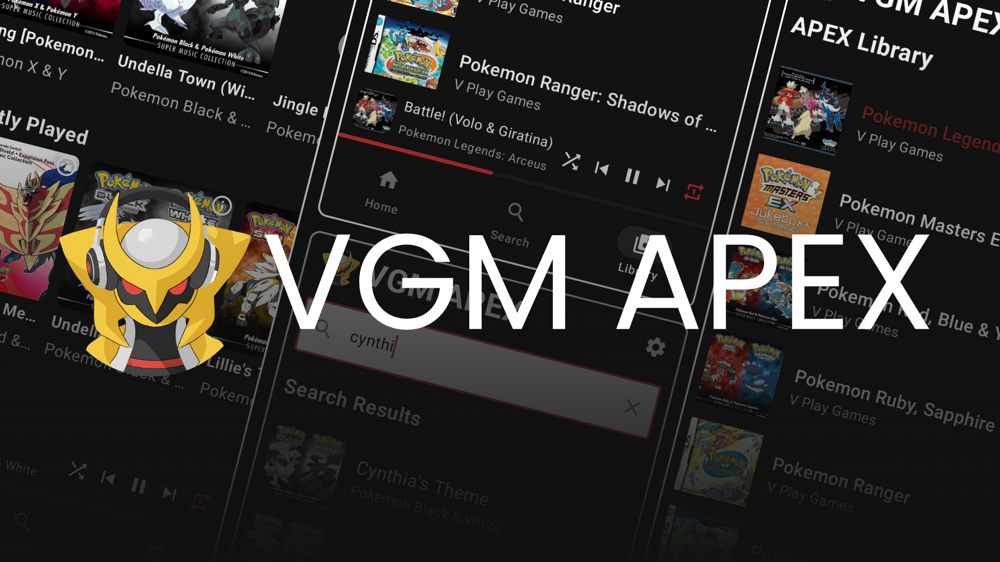
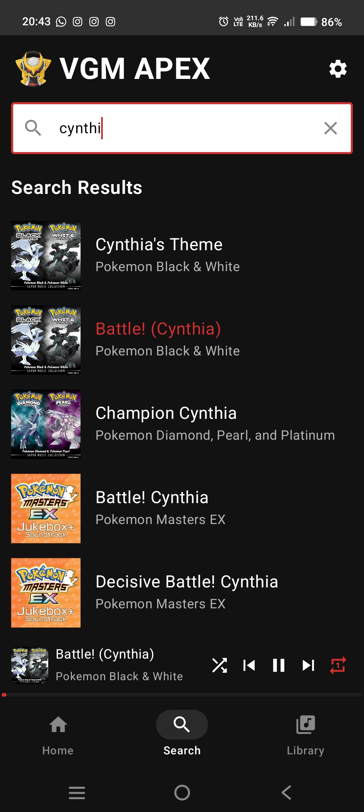

  
  <h1>Video Game Music Audio Player EX</h1>

## 🎮 A Spotify-like Experience for Video Game Music Enthusiasts

VGM APEX is a dedicated audio streaming platform designed specifically for video game music lovers. Explore thousands of tracks from your favorite games, create custom playlists, and discover new soundtracks all in one elegant application.

## ✨ Features

- **Extensive Game Music Library**: Browse through thousands of tracks from classic to modern video games
- **Seamless Looping**: Loop your favourite soundtrack seamlessly without having to listen to the intro everytime, just like in the actual games!
- **Album & Track Info**: View detailed information about tracks and albums with beautiful album art
- **Search & History**: Instant search functionality with search history and play history tracking
- **Offline Support**: Download your favorite tracks for offline listening
- **Shuffle Mode**: Randomize your listening experience with the shuffle functionality
- **Queue Management**: View and manage your current play queue
- **Player Controls**: 
  - Seek through tracks with the SeekBar
  - Control playback from your phone's notification panel
  - Play all tracks in a category at once (Album, Uploader, Random Picks, etc.)
- **Modern UI Elements**:
  - Shimmer animations for loading content
  - Interactive tap animations
  - Marquee effect for long track names
  - Dark/Light Theme that changes automatically with system settings
- **Customizable UI**
  - Choose between different themes and color accents
  - Choose between different layouts for the home screen
  - Adjust animation speed
- Regular updates with new features and improvements
- ~~**Personalized Experience**: Create custom playlists, mark favorites, and get recommendations based on your listening habits~~ (Coming Soon!)
- ~~**Advanced Search**: Find music by game, composer, genre, console, or year~~ (Coming Soon!)
- ~~**Social Features**: Share your favorite tracks and playlists with friends~~ (Coming Soon!)

## 📱 Screenshots

  
  
  
  

## 🚀 Getting Started

### Prerequisites

- Android 9+
- Internet connection for streaming (offline mode coming soon!)

### Download

#### Mobile
- [Download from GitHub Releases](https://github.com/V-Play-Games/VGM-APEX/releases/latest)
- [Download on Google Play] (Coming Soon!)

## 🔧 For Developers

### Tech Stack

- **Frontend**: Kotlin, Jetpack Compose
- **Backend**: Coming Soon (maybe)
- **Database**: Static JSON
- **Audio Storage**: GitHub Repositories :3